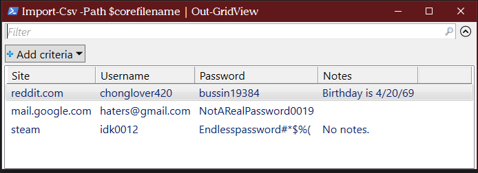
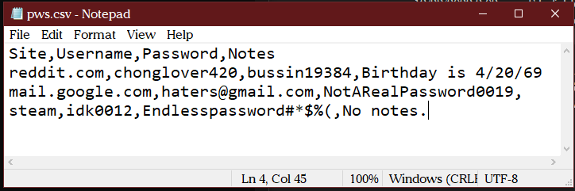

# BarrdVault
##### The world's jankiest (yet somehow fast and functional) 100% offline password manager

##### a rusty lock, a fitting analogy

# How it works
All your passwords are kept in an encrypted CSV.
You unlock (decrypt) this CSV with a master password.
When you change the CSV (e.g., add a new entry), you enter another master password (it is ok to use the same one) to re-encrypt the file.

# Installation
1. Install Powershell 7.3.0  from the [official source](https://github.com/PowerShell/PowerShell/releases/download/v7.3.0/PowerShell-7.3.0-win-x64.msi)
2. Install [GPG4Win](https://gpg4win.org/download.html)
3. Download the package (download code as .zip) and extract the package.
4. Right click on `view.ps1` or `edit.ps1`
    - Go to "Open With" and select PowerShell (or `pwsh.exe`) if it is available.
    - Then, select the "Always open with" checkbox.
5. Double click "view.ps1" to ensure the script is working. Use the default master password of `testpw001` to use it.
	
	
# Usage

### To view password info:
- Double click (or Right click and select "Run with powershell") on `view.ps1`.
- Enter your password. The default password is `testpw001`
- You can filter with the box on top.
- Close the window and hit any key to exit. 

### To edit or add password info: 
- Double click (or right click and select "Run with powershell") on `edit.ps1`.
- Edit existing entries or add new ones as CSV. There must be four columns as shown in the first row.
- Exit out of notepad.
- You will be prompted for another password. You can use the same one as before. **Remember it! It's your one master password and your data will be entirely lost if you forget it. Write it down somewhere physical maybe!**
- Hit any key to exit. Your new data has been saved and encrypted. 

