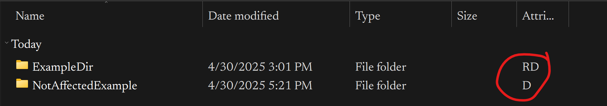

## Recursively remove ReadOnly Attribute from windows directories and files

I was having a problem where the files I saw in FileExplorer did not match what I saw in Powershell or what was seen by other programs. This is obviously a problem bc. I cant tell what the actual names of any files are. **I also could not change the names of the files thru FileExplorer**, meaning I'd edit it in FE, it would not be reflected in programs/shells,  then even in FE it would revert back to the old name.

This is from Window's "ReadOnly" attribute being set on these directories:

Real names of the affected folder

Do not show in FileExplorer if they are changed when readonly:

Changing/finding `desktop.ini`, using `cmd`' `attrib` commmand, and using the Properties GUI or permissions editing were online solutions but *they do NOT work*. The only thing that works is shell commands to change the file/dir attribs.

The `ChangeReadOnly` script removed ReadOnly recursively from all  files and folders under  the root dir.

The `CheckReadOnly` script just prints which files and folders have ReadOnly set.

**Change the root dir in the scripts to the affected root dir!**