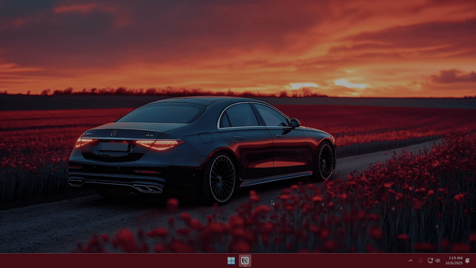

Use fade.ahk for a script that fades between visible icons and invisible icons. Change the sleep time to make it faster/slower.
Unfortunately, I (and the AI) couldnt figure out how to stop the screen from fading black instead of pure transparent, so there is a weird black fade effect.
Maybe it will affect you, maybe not, but it does affect my system. Its less jarring than the gif makes it seem.

Use nofade.ahk for a script that simply toggles the visibiltiy on/off instantly.

Both scripts use "Win+`" (the thing under escape on most keyboards) as the toggle hotkey.

The "hide.ahk" script just hides the icons once, after waiting 5 seconds. Can be used in the windows startup folder to hide the icons immediately upon login.

###### Perplexity AI helped write these scripts for autohotkey V2. 