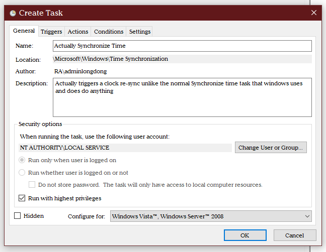
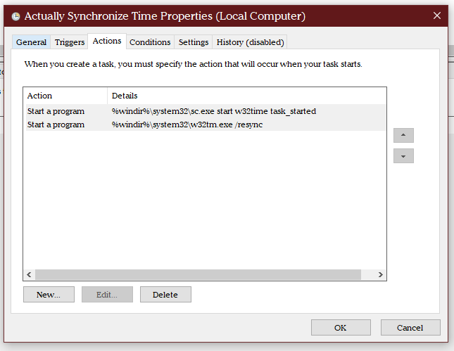
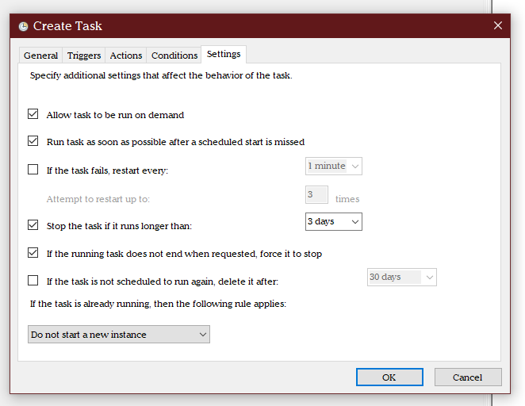
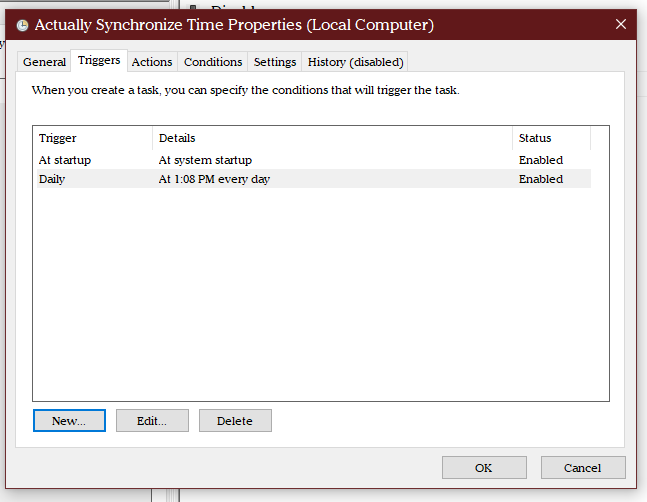
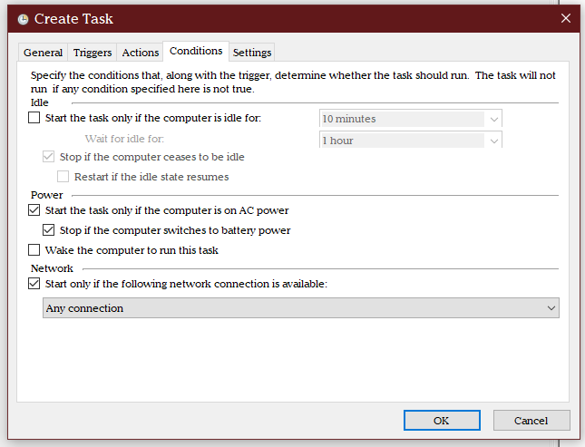
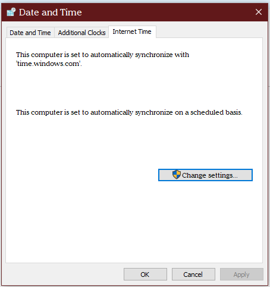

# Motivation

Dual boot with Ubuntu causes Windows time to constantly be off.
This is because the format (UTC vs local) of Windows and Ubuntu are different,
and Ubuntu syncs to the hardware clock while Windows reads to it.


So the windows "sync to internet" option syncs way too infrequently (i.e., not on login.

# Fixing with windows Task Scheduler

Go to `Task Scheduler` and `Task Scheduler Library >> Windows >> Windows >> Time Synchronization` and open
create a new task. 

Then fill it out according to the below:






Open up `Control Panel >> date and time` and make sure Windows is using internet as source of time for the time sync.




Open up a command prompt as an administrator and try the commands it will be running.

```
C:\WINDOWS\system32>%windir%\system32\sc.exe start w32time task_started

SERVICE_NAME: w32time
        TYPE               : 20  WIN32_SHARE_PROCESS
        STATE              : 2  START_PENDING
                                (NOT_STOPPABLE, NOT_PAUSABLE, IGNORES_SHUTDOWN)
        WIN32_EXIT_CODE    : 0  (0x0)
        SERVICE_EXIT_CODE  : 0  (0x0)
        CHECKPOINT         : 0x0
        WAIT_HINT          : 0x7d0
        PID                : 19212
        FLAGS              :

C:\WINDOWS\system32>
```

